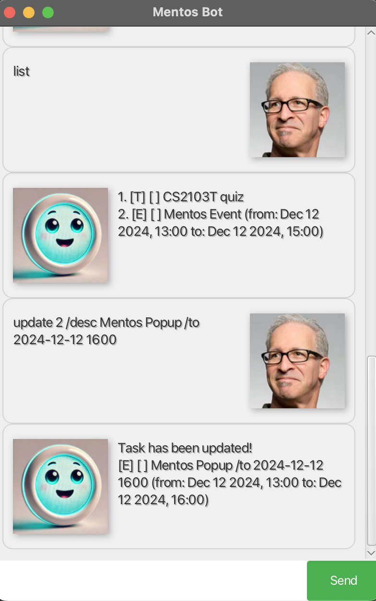

# Mentos User Guide



## Welcome to Mentos
Mentos is a task management chatbot designed to help you organize and stay on top of your tasks with ease. Whether you're managing simple to-dos, important deadlines, or scheduled events, Mentos provides a streamlined interface to keep everything in check.

With intuitive commands, you can add tasks, mark them as done or undone, update any details, and even search through your tasks by their descriptions. Mentos supports three primary task types—Todo, Deadline, and Event—allowing you to handle different categories of tasks efficiently.

Designed to be flexible and user-friendly, Mentos is your go-to assistant for staying organized, whether it's for school projects, work tasks, or personal reminders. Start using Mentos today to simplify your task management!
# Features

## Todo
A `Todo` task represents a general task without any specific deadline or time range.

### Usage:
```declarative
todo <description>
```

### Example
```declarative
todo Buy Groceries
```
This command adds a todo ask with the description "Buy Groceries".

## Deadline 
A `Deadline` task represents a task that needs to be completed by a certain date and time.

### Usage:
```declarative
deadline <description> /by <datetime>
```
- **/by <datetime>**: The deadline in the format `yyyy-mm-dd hhmm`.

### Example
```declarative
deadline Submit assignment /by 2024-09-20 2359
```
This command adds a `Deadline` task with the description “Submit assignment” and a due date of September 20, 2024, at 11:59 PM.

## Event
An `Event` task represents an activity that occurs within a specific time range.

#### Usage:
```declarative
event <desc> /from <datetime> /to <datetime>
```
- **/from <datetime>**: The start time of the event in the format `yyyy-mm-dd hhmm`.
- **/to <datetime>**: The end time of the event in the format `yyyy-mm-dd hhmm`.

### Example
```declarative
event Project meeting /from 2024-09-21 1000 /to 2024-09-21 1200
```
This command adds an Event task with the description “Project meeting” from 10:00 AM to 12:00 PM on September 21, 2024.


## Listing Tasks
Mentos can list all of the tasks added by using the command `list`.

### Usage:
```declarative
list
```

## Delete Tasks
Mentos can delete task by using the task index.

### Usage:
```declarative
delete <index>
```

## Marking and Unmarking Tasks
Mentos can mark tasks as completed by using the task index.

### Usage:
- **Mark task as completed:**
    ```
    mark <index>
    ```
- **Unmark task as uncompleted:**
    ```
    unmark <index>
    ```

## Updating Task
Mentos allows you to update any fields in a task by specifying the task index and the new values. The fields that can be updated vary depending on the type of task (Todo, Deadline, or Event).

### Usage:
```declarative
update <index> /desc <new_desc> [/by <new_datetime>] [/from <new_start_datetime> /to <new_end_datetime>]```
```
### Examples:
1. **Updating a Todo Task:**
    ```
    update 1 /desc Buy milk
    ```
    This updates the description of the task at index 1 to "Buy milk".


2. **Updating a Deadline Task:**
    ```
    update 2 /desc Submit final report /by 2024-09-25 2359
    ```
    This updates the description and deadline of the task at index 2.


3. **Updating an Event Task:**
    ```
    update 3 /desc Team meeting /from 2024-09-20 1000 /to 2024-09-20 1200
    ```
    This updates the description, start time, and end time of the event at index 3.

Mentos makes it easy to keep your tasks up to date, no matter the task type—whether you're changing the description, updating a deadline, or adjusting the timing for an event. You have full control over your task details!


## Searching Tasks
Mentos allows you to search for tasks by their description using the `find` command. This feature is helpful for quickly locating tasks that contain a specific keyword or phrase.

### Usage:
```declarative
find <keyword in description>
```
## Exiting Mentos
To exit Mentos, use the `bye` command to end the chatbot session.
### Usage:
```declarative
bye
```
